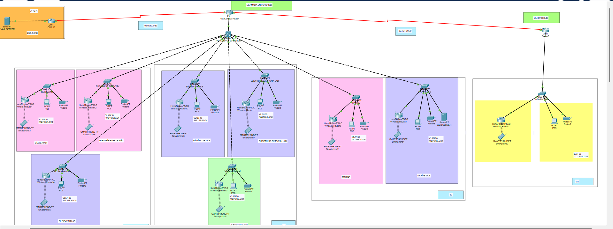

# Marmara Üniversitesi Network Ağ Yapısı

#  Overwiev
This project presents a simulated campus network of Marmara University using Cisco Packet Tracer. The design includes both a main campus and a branch campus (Engineering Faculty). Each department is assigned to its own VLAN. Routing has been implemented using the RIP protocol. The scenario also includes mobile device connectivity, servers, and printers.
# 🏛️ Main Campus
Departments located in the main campus:
🖥️ Computer Engineering (VLAN 10 & VLAN 30)
⚡ Electrical & Electronics Engineering (VLAN 20 & VLAN 50)
🔧 Mechanical Engineering (VLAN 70 & VLAN 80)
🎓 Student Support Center (VLAN 60)
📧 Mail Server (Connected via cloud module)
# 🏗️ Branch Campus – Faculty of Engineering
🌐 Engineering Faculty (LAN 90 – 172.168.9.0/24)
Connected to the main campus via router-to-router link.
# Technologies Used
Cisco Packet Tracer 8.x
RIP Routing Protocol
Static IP addressing & Subnetting
VLANs with wireless router setups
Scenario including PCs, smartphones, printers, and servers
# 🖼️ Project Topology

